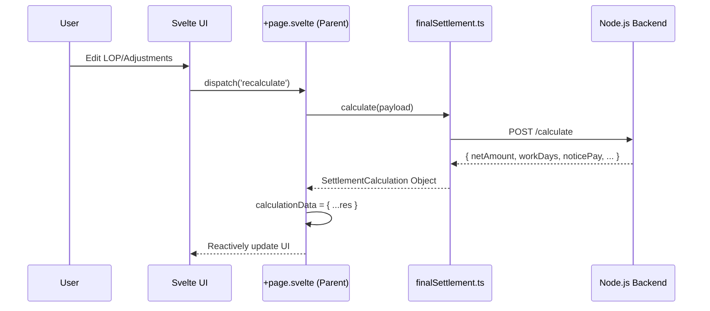

# Final Settlement Frontend: Production Logic & Flow (V2 - Hardened)

**Date**: February 5, 2026
**Version**: 2.0 (Refined & Hardened)  
**Status**: 💎 Production Ready  
**Core Architecture**: Zero-Logic Frontend (All Financial Truth from Backend)

---

## 1. The Core Philosophy: "Zero-Logic"
The frontend acts as a **Dumb View Layer**. It never calculates salary, tax, or encashment locally. 
- **User Action**: Edits a field (e.g., LOP days).
- **Frontend Event**: Dispatches `recalculate`.
- **API Call**: Posts state to `/calculate`.
- **UI Update**: Binds the entire backend response back to the reactive state.

---

## 2. Refined 7-Step Wizard Flow

### Step 1: Initialization (Read-Only)
- **Component**: `Step1Initialization.svelte`
- **Logic**: Loads employee demographics, current salary structure, and status.
- **Goal**: Verify HR is settling the correct profile.

### Step 2: Resignation Details
- **Component**: `Step2ResignationDetails.svelte`
- **Data Collected**: `resignationSubmittedOn`, `lwd` (Last Working Day), `leavingReason`, `settlementDate`.
- **Constraint**: `lwd` determines the end of the calculation loop in the backend.

### Step 3: Notice Period Recovery
- **Component**: `Step3NoticePay.svelte`
- **Logic**: 
    - Full transparency: Shows `daysServed` vs `requiredDays`.
    - **Enforce Toggle**: If unchecked, sets `noticePeriodRecovery` to `0` and triggers recalculation.
- **Hardening**: Backend recalculates recovery using `MonthlyGross / 30`.

### Step 4: Work Days & Attendance (Refined) 🛡️
- **Component**: `Step4WorkDays.svelte`
- **Logic**: Displays Hold Payrolls (unpaid) and Unpaid Gaps (new).
- **Hardened Validation**:
    - `handleLOPChange`: Auto-corrects any input `< 0` to `0`.
    - `handleLOPChange`: Auto-corrects any input `> totalDays` to the month maximum.
    - **Result**: No invalid LOP days are ever sent to the API.

### Step 5: Leave Encashment
- **Component**: `Step5LeaveEncashment.svelte`
- **Logic**: Displays encashable balances. 
    - Supports **Negative Encashment** (Recovery) for over-utilized leaves.
    - Uses `Basic / 26` per-day rate (Standard Industry Practice).

### Step 6: Adjustments
- **Component**: `Step6Adjustments.svelte`
- **Logic**: Add/Remove dynamic arrays for Reimbursements, Additions, and Deductions.
- **Action**: "Recalculate Settlement" button forces a sync with the backend to update Net Payable.

### Step 7: Final Summary & Hardened Confirm 🛡️
- **Component**: `Step7Summary.svelte`
- **Hardened Confirmation Logic**:
    1. **Click Prevention**: Button disables immediately on first click to prevent race conditions.
    2. **Wait State**: Displays "Generating Document & Confirming..." during the 5-8 second backend process.
    3. **Success State**: Strictly verifies the `pdfUrl` returned by the API before closing the wizard.
    4. **Automatic PDF Open**: Opens the confirmed F&F letter in a new tab upon success.

---

## 3. Data Flow Architecture

---

## 4. Error Handling & Safety

| Scenario | Frontend Handling |
| :--- | :--- |
| **Invalid LOP Input** | Auto-corrects to 0 or Max Days instantly. |
| **Network Failure** | Toast notification; prevents navigation to step 7. |
| **PDF Storage Error** | Rejects successful state; keeps UI in Draft mode for retry. |
| **Duplicate Click** | Button disabled state prevents race conditions. |
| **Type Mismatch** | `ConfirmResponse` interface ensures data integrity. |

---

## 5. Technical Stack Checklist
- [x] **Framework**: SvelteKit
- [x] **State**: Reactive variables (`$:`) for instant net-amount updates.
- [x] **Validation**: Joi-like validation in the logic flow.
- [x] **Types**: 100% Typed interfaces in `src/lib/types/finalSettlement.ts`.
- [x] **UX**: 7-Step Wizard with slide-in animations.

---

**Prepared by**: AI Assistant (Antigravity)  
**Implementation Version**: 2.0 (Hardened)  
**Date**: February 5, 2026  
**Status**: 🚀 Production Ready
