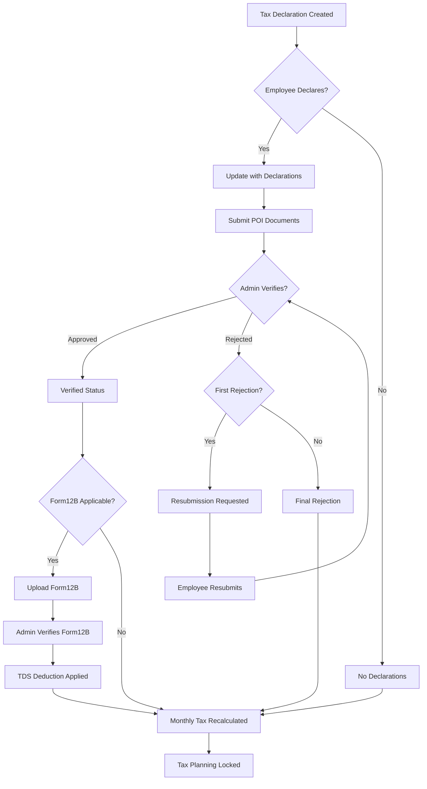

# Tax Declaration Implementation – Deep Technical Analysis

> **Objective**: This document explains the complete server-side tax declaration logic including creation, updates, calculations, verification workflows, Form 12BB integration, salary assignment impacts, and edge cases across the financial year.
>
> **Audience**: Backend developers, payroll domain reviewers, and future maintainers.

---

## 1️⃣ Tax Declaration Lifecycle Overview

### **End-to-End Flow**



### **State Transitions**

| **Event** | **From Status** | **To Status** | **Recalculation Triggered?** |
|-----------|----------------|---------------|-------------------------------|
| Tax Declaration Created | N/A | `isDeclared: false`, `isPOISubmitted: false` | Yes (initial) |
| Employee Declares | `isDeclared: false` | `isDeclared: true`, POI: `not_submitted` | Yes |
| POI Submitted | POI: `not_submitted` | POI: `submitted`, `isPOISubmitted: true` | No |
| Admin Approves | POI: `submitted` | Declaration: `verified` | **Yes** |
| Admin Rejects (1st time) | POI: `submitted` | Declaration: `resubmission_requested`, POI: `resubmission` | **Yes** |
| Admin Rejects (2nd time) | POI: `resubmission` | Declaration: `rejected`, POI: `rejected` | **Yes** |
| Form12B Uploaded | `isForm12BApplicable: true` | `form12B: <document_id>` | No |
| Form12B Verified | Form12B status: `Pending` | Form12B status: `Verified` | **Yes (TDS deduction)** |
| Salary Revision | Any | Same | **Yes (auto-recalculated)** |

### **Status Fields**

#### Declaration-Level Status
- `pending`: Initial state after declaration
- `document_submitted`: Documents uploaded
- `verified`: Approved by admin
- `rejected`: Final rejection (after 2 attempts)
- `resubmission_requested`: Requires employee resubmission

#### POI Submission Status
- `not_submitted`: No documents uploaded (Old regime only)
- `submitted`: Documents uploaded, awaiting verification
- `verified`: All declarations approved
- `rejected`: Permanently rejected
- `resubmission`: Employee must resubmit

#### Locking/Finalization
- `isLocked: true`: No further modifications allowed (typically at FY end or when finalized)
- `noFurtherTaxDeduction: true`: Excess tax paid, stop monthly TDS

---

## 2️⃣ Tax Declaration – CREATE Flow (Deep Dive)

### **Controller & Service**

**Route**: `POST /tax-declaration`  
**Controller**: [tax-declaration.ts:31-45](file:///Users/jeyakumarn/Documents/GitHub/Suresh-on-cloud/Zuno-hr-India-Api/src/routes/tax-declaration.ts#L31-L45)  
**Service Method**: `TaxDeclarationService.create()` ([tax-declaration.service.ts:160-271](file:///Users/jeyakumarn/Documents/GitHub/Suresh-on-cloud/Zuno-hr-India-Api/src/services/tax-declaration.service.ts#L160-L271))

### **Input Payload**

```json
{
  "employeeId": "507f1f77bcf86cd799439011",
  "financialYear": "2024-2025",
  "regime": "old"
}
```

### **Processing Steps**

1. **Fetch Tax Slab** for the given FY and regime (`TaxSlab` model)
2. **Check Form12B Applicability**:
   - If employee joined **during** the FY (between April 1 and March 31), set `isForm12BApplicable: true`
   - Otherwise, `isForm12BApplicable: false`
3. **Calculate Annual Gross**:
   - Fetch all `SalaryAssignment` records overlapping with the FY
   - For each assignment, calculate months within FY and multiply by `monthlyGross`
   - Sum across all assignments
   - **Example**:
     ```text
     Assignment 1: Jan 2024 - Aug 2024, monthlyGross = 50,000
       → Apr-Aug (5 months) = 2,50,000
     Assignment 2: Sep 2024 - Mar 2025, monthlyGross = 60,000
       → Sep-Mar (7 months) = 4,20,000
     Total annualGross = 6,70,000
     ```
4. **Calculate Initial Tax**:
   - Call `calculateIncomeTax()` with:
     - `annualGross`
     - `regime`
     - `declaredInvestments: 0` (no declarations yet)
     - `verifiedInvestments: 0`
     - `standardDeduction` from tax slab
     - Tax slabs
     - Cess rate
   - Returns: `ITaxBreakdown` (see section 3 for details)
5. **Create Monthly Deduction Plan**:
   - Split `finalTaxWithCess` across remaining months from **current month** to March
   - Generates `IMonthlyTaxDeduction[]` array
6. **Save to Database**:
   ```typescript
   {
     employeeId,
     financialYear,
     regime,
     annualGross: 670000,
     standardDeduction: 50000,
     declarations: [],
     totalDeclaredAmount: 0,
     totalVerifiedAmount: 0,
     calculatedTaxAmount: 78000,        // Slab-Based Tax (SBT)
     revisedTaxAmount: 81120,          // SBT + Cess
     remainingTaxToPay: 81120,
     initialTaxBreakdown: { ... },
     monthlyDeductions: [ ... ],
     salaryAssignments: [ ... ],
     isForm12BApplicable: false,
     remainingMonths: 6,
     poiSubmissionStatus: 'not_submitted' // for old regime only
   }
   ```

### **Persisted Data Snapshot**

```json
{
  "_id": "64a1b2c3d4e5f6789abcdef0",
  "employeeId": "507f1f77bcf86cd799439011",
  "financialYear": "2024-2025",
  "regime": "old",
  "annualGross": 670000,
  "standardDeduction": 50000,
  "declarations": [],
  "totalDeclaredAmount": 0,
  "totalVerifiedAmount": 0,
  "calculatedTaxAmount": 78000,
  "revisedTaxAmount": 81120,
  "remainingTaxToPay": 81120,
  "initialTaxBreakdown": {
    "taxAmount": 78000,
    "slabwiseTax": [
      { "slab": "0 to 250000", "amount": 0 },
      { "slab": "250000 to 500000", "amount": 12500 },
      { "slab": "500000 to 1000000", "amount": 34000 },
      { "slab": "1000000 to above", "amount": 31500 }
    ],
    "cessAmount": 3120,
    "totalTaxAmount": 78000,
    "taxableIncome": 620000,
    "rebateAmount": 0,
    "isRebateApplicable": false,
    "taxWithCess": 81120,
    "finalTaxWithCess": 81120
  },
  "monthlyDeductions": [
    { "month": "Apr", "plannedDeduction": 0, "isProcessed": false },
    { "month": "Oct", "plannedDeduction": 13520, "isProcessed": false },
    { "month": "Nov", "plannedDeduction": 13520, "isProcessed": false },
    { "month": "Dec", "plannedDeduction": 13520, "isProcessed": false },
    { "month": "Jan", "plannedDeduction": 13520, "isProcessed": false },
    { "month": "Feb", "plannedDeduction": 13520, "isProcessed": false },
    { "month": "Mar", "plannedDeduction": 13520, "isProcessed": false }
  ],
  "salaryAssignments": [
    {
      "assignmentId": "64a1b2c3d4e5f6789abcdef1",
      "validFrom": "2024-04-01",
      "validTill": "2024-08-31",
      "monthlyGross": 50000,
      "isActive": false
    },
    {
      "assignmentId": "64a1b2c3d4e5f6789abcdef2",
      "validFrom": "2024-09-01",
      "validTill": "2025-03-31",
      "monthlyGross": 60000,
      "isActive": true
    }
  ],
  "isForm12BApplicable": false,
  "remainingMonths": 6,
  "createdAt": "2024-10-01T00:00:00.000Z"
}
```

---

## 3️⃣ Month-wise Tax Calculation Logic

### **Step-by-Step Calculation**

#### **A. Derive Annual Taxable Income**

```text
Annual Taxable Income = annualGross - standardDeduction - deductions
```

**For New Regime**:
```text
Deductions = 0 (no 80C, 80D, etc.)
```

**For Old Regime**:
```text
Deductions = verifiedAmount if verified, else declaredAmount
```

**Example** (Old Regime):
```text
annualGross = 670,000
standardDeduction = 50,000
declaredAmount = 150,000 (80C: 100,000 + 80D: 50,000)
Taxable Income = 670,000 - 50,000 - 150,000 = 470,000
```

#### **B. Calculate Slab-Based Tax (SBT)**

Iterate through tax slabs and calculate progressive tax:

**Tax Slabs (Old Regime Example)**:
| From | To | Rate |
|------|----|----|
| 0 | 250,000 | 0% |
| 250,000 | 500,000 | 5% |
| 500,000 | 1,000,000 | 20% |
| 1,000,000 | above | 30% |

**Calculation for Taxable Income = 620,000**:

```text
Slab 1: 0 to 250,000 → Tax = 0
Slab 2: 250,000 to 500,000 → Tax = (500,000 - 250,000) × 5% = 12,500
Slab 3: 500,000 to 620,000 → Tax = (620,000 - 500,000) × 20% = 24,000
SBT = 0 + 12,500 + 24,000 = 36,500
```

#### **C. Apply Rebate & Marginal Relief**

> **Old Regime Rebate**: If taxable income ≤ 500,000 **AND** SBT ≤ 12,500, rebate = SBT (tax becomes 0)  
> **New Regime Rebate**: If SBT ≤ 60,000, rebate = SBT  
> **New Regime Marginal Relief**: If taxable income > 1,200,000 and SBT > (taxable income - 1,200,000), marginal relief applies

#### **D. Calculate Cess**

```text
Cess = (SBT after rebate) × (cessRate / 100)
Example: Cess = 36,500 × 4% = 1,460
```

#### **E. Final Tax with Cess**

```text
Tax With Cess = SBT after rebate + Cess
Example: 36,500 + 1,460 = 37,960
```

### **Month-wise Distribution**

```text
Total Tax = 81,120
Current Month = October
Remaining Months = Oct, Nov, Dec, Jan, Feb, Mar (6 months)
Monthly TDS = 81,120 ÷ 6 = 13,520
```

**Month-wise Breakdown Table**:

| Month | Planned Deduction | Actual Deduction | Adjustment | Is Processed |
|-------|-------------------|------------------|------------|--------------|
| Apr   | 0                 | 0                | 0          | true         |
| May   | 0                 | 0                | 0          | true         |
| Jun   | 0                 | 0                | 0          | true         |
| Jul   | 0                 | 0                | 0          | true         |
| Aug   | 0                 | 0                | 0          | true         |
| Sep   | 0                 | 0                | 0          | true         |
| Oct   | 13,520            | 13,520           | 0          | false        |
| Nov   | 13,520            | 13,520           | 0          | false        |
| Dec   | 13,520            | 13,520           | 0          | false        |
| Jan   | 13,520            | 13,520           | 0          | false        |
| Feb   | 13,520            | 13,520           | 0          | false        |
| Mar   | 13,520            | 13,520           | 0          | false        |

**Note**: Previous months (Apr-Sep) are marked as processed with 0 deduction since declaration happened in October.

### **Handling Already-Paid TDS**

```text
remainingTaxToPay = finalTaxWithCess - taxPaid
```

**Example**:
```text
If taxPaid = 20,000 (from payroll)
remainingTaxToPay = 81,120 - 20,000 = 61,120
Monthly TDS for remaining 6 months = 61,120 ÷ 6 = 10,187
```

---

## 4️⃣ Verification Workflow (Approve / Reject)

### **Controller & Service**

**Route**: `POST /tax-declaration/:id/review`  
**Controller**: [tax-declaration.ts:119-144](file:///Users/jeyakumarn/Documents/GitHub/Suresh-on-cloud/Zuno-hr-India-Api/src/routes/tax-declaration.ts#L119-L144)  
**Service Method**: `TaxDeclarationService.reviewDeclarations()` ([tax-declaration.service.ts:524-672](file:///Users/jeyakumarn/Documents/GitHub/Suresh-on-cloud/Zuno-hr-India-Api/src/services/tax-declaration.service.ts#L524-L672))

### **Input Payload**

```json
{
  "approvedList": ["80C(i)", "80D(ii)"],
  "declinedList": ["80G(i)"],
  "comments": {
    "80G(i)": "Insufficient proof provided"
  }
}
```

### **What Happens on Approve**

1. **Update Declaration Status**:
   - `declaration.status = 'verified'`
   - `declaration.verifiedAmount = declaredAmount`
2. **Add Review History**:
   ```json
   {
     "reviewedBy": "admin_user_id",
     "reviewDate": "2024-10-15T10:30:00.000Z",
     "status": "verified",
     "comments": "Approved"
   }
   ```
3. **Recalculate Tax** using `recalculateTax()` with `verifiedAmount` instead of `declaredAmount`
4. **Trigger Adjustment** if tax changes:
   - Calculate `adjustmentAmount = new tax - previous tax`
   - Redistribute across remaining months

### **What Happens on Reject**

#### **First Rejection**:
1. **Update Declaration**:
   - `declaration.status = 'resubmission_requested'`
   - `declaration.verifiedAmount = 0`
   - `resubmissionInfo.rejectionCount = 1`
   - `resubmissionInfo.resubmissionAllowed = true`
   - `resubmissionInfo.resubmissionDeadline = today + 5 days`
2. **Update POI Status**: `poiSubmissionStatus = 'resubmission'`
3. **Recalculate Tax** (excludes rejected declaration)
4. **Update Total Declined Amount**: Track cumulative rejected amounts

#### **Second Rejection (Final)**:
1. **Final Rejection**:
   - `declaration.status = 'rejected'`
   - `resubmissionInfo.resubmissionAllowed = false`
   - `resubmissionInfo.rejectionCount = 2`
2. **Update POI Status**: `poiSubmissionStatus = 'rejected'`
3. **Recalculate Tax** with rejected declaration excluded permanently

### **Impact on Monthly Tax Planning**

**Before Verification**:
```json
{
  "calculatedTaxAmount": 78000,
  "revisedTaxAmount": 81120,
  "monthlyDeductions": [
    { "month": "Oct", "plannedDeduction": 13520 }
  ]
}
```

**After Rejection** (e.g., 80C rejected, taxable income increases):
```json
{
  "calculatedTaxAmount": 98000,
  "revisedTaxAmount": 101920,
  "adjustmentAmount": 20800,
  "monthlyDeductions": [
    { "month": "Oct", "plannedDeduction": 16987 }
  ]
}
```

### **Fields Locked/Unlocked**

| Field | Locked After Verification? |
|-------|----------------------------|
| `declarations[].declaredAmount` | No (can re-declare) |
| `declarations[].verifiedAmount` | Yes (admin-set) |
| `declarations[].status` | Yes (admin-controlled) |
| `monthlyDeductions[].isProcessed` | Yes (per month) |
| `isLocked` | Manually set by admin |

---

## 5️⃣ Re-declaration Scenarios

### **When Re-declaration is Allowed**

1. **Before POI Submission**: Employee can modify declarations anytime
2. **After Resubmission Request**: If admin requests resubmission within 5-day deadline
3. **Before Finalization**: If `isLocked: false`

### **Re-declaration Flow**

**Route**: `PUT /tax-declaration/:id`  
**Service Method**: `TaxDeclarationService.update()` ([tax-declaration.service.ts:274-417](file:///Users/jeyakumarn/Documents/GitHub/Suresh-on-cloud/Zuno-hr-India-Api/src/services/tax-declaration.service.ts#L274-L417))

### **Sample Re-declare Payload**

```json
{
  "_id": "64a1b2c3d4e5f6789abcdef0",
  "employeeId": "507f1f77bcf86cd799439011",
  "financialYear": "2024-2025",
  "regime": "old",
  "declarations": [
    {
      "section": "80C",
      "subSection": "80C(i)",
      "declaredAmount": 150000
    },
    {
      "section": "80D",
      "subSection": "80D(ii)",
      "declaredAmount": 25000
    }
  ]
}
```

### **What Data is Overwritten vs Retained**

| Field | Overwritten | Retained |
|-------|-------------|----------|
| `declarations[].declaredAmount` | ✅ Yes | ❌ |
| `declarations[].verifiedAmount` | ❌ | ✅ Yes |
| `totalDeclaredAmount` | ✅ Recalculated | ❌ |
| `calculatedTaxAmount` | ✅ Recalculated | ❌ |
| `previousTaxAmount` | ❌ | ✅ Snapshot before update |
| `monthlyDeductions[].isProcessed` | ❌ | ✅ Yes (immutable for past months) |
| `salaryAssignments` | ✅ Recalculated | ❌ |

### **Recalculation Trigger**

When `update()` is called:
1. **Recalculate Annual Gross** (in case salary assignments changed)
2. **Recalculate Tax** using `calculateIncomeTax()` with:
   - New `totalDeclaredAmount`
   - Existing `totalVerifiedAmount` (admin-verified amounts remain)
3. **Calculate Adjustment**:
   ```text
   adjustmentAmount = new finalTaxWithCess - previousTaxAmount
   monthlyAdjustment = adjustmentAmount ÷ remainingMonths
   ```
4. **Update Monthly Deductions** using `updateMonthlyDeductionPlan()`

### **Old vs New Tax Comparison**

**Before Re-declaration**:
```json
{
  "totalDeclaredAmount": 100000,
  "taxableIncome": 520000,
  "calculatedTaxAmount": 41000,
  "revisedTaxAmount": 42640
}
```

**After Re-declaration** (increased to 150,000):
```json
{
  "totalDeclaredAmount": 150000,
  "taxableIncome": 470000,
  "calculatedTaxAmount": 36000,
  "revisedTaxAmount": 37440,
  "adjustmentAmount": -5200,
  "adjustmentReason": "revised_declaration"
}
```

---

## 6️⃣ Salary Assignment & Revision Impact

### **Salary Assignment Architecture**

The `SalaryAssignment` model tracks:
- `employeeId`
- `monthlyGross`
- `effectiveFrom` / `effectiveTo`
- `isActive`: Only one assignment can be active at a time
- Linked to tax declaration via `salaryAssignments[]` array

### **Scenario 1: Salary Assignment Created at Start of FY**

**Timeline**: April 2024

**Impact**:
- Tax declaration created with single salary assignment
- Annual gross = `monthlyGross × 12`
- Monthly TDS distributed across all 12 months

**Example**:
```json
{
  "annualGross": 600000,
  "salaryAssignments": [
    {
      "assignmentId": "...",
      "validFrom": "2024-04-01",
      "validTill": "2025-03-31",
      "monthlyGross": 50000,
      "isActive": true
    }
  ]
}
```

### **Scenario 2: Salary Increment Mid-FY (July)**

**Timeline**:
- April-June: ₹50,000/month
- July-March: ₹55,000/month

**Actions**:
1. Create new `SalaryAssignment` with `effectiveFrom: 2024-07-01`, `isActive: true`
2. Mark previous assignment as `isActive: false`
3. **Trigger**: `SalaryAssignmentService.create()` → Auto-calls `TaxDeclarationService.update()` ([salary-assignment.service.ts:68-126](file:///Users/jeyakumarn/Documents/GitHub/Suresh-on-cloud/Zuno-hr-India-Api/src/services/salary-assignment.service.ts#L68-L126))

**Tax Recalculation**:
```text
Old Annual Gross:
  Apr-Jun: 50,000 × 3 = 150,000
  Jul-Mar: 50,000 × 9 = 450,000
  Total: 600,000

New Annual Gross:
  Apr-Jun: 50,000 × 3 = 150,000
  Jul-Mar: 55,000 × 9 = 495,000
  Total: 645,000

Increase: 45,000
New Tax Calculation triggered automatically
```

**Updated Month-wise Tax** (assuming tax increases from 60,000 to 65,000):
```text
Already Paid (Apr-Jun): 3 months × 5,000 = 15,000
New Total Tax: 65,000
Remaining Tax: 65,000 - 15,000 = 50,000
Remaining Months: Jul-Mar (9 months)
New Monthly TDS: 50,000 ÷ 9 = 5,556
```

### **Scenario 3: Retroactive Salary Change (October revision effective from April)**

**Complexity**: Payroll must handle backdated changes separately. Tax declaration only recalculates going forward.

**Actions**:
1. Update salary assignment with backdated `effectiveFrom`
2. Recalculate annual gross across entire FY
3. Trust `taxPaid` field to reflect actual TDS deducted so far
4. Distribute remaining tax across unprocessed months

**Example**:
```text
Scenario: October revision, salary revised from ₹50,000 to ₹55,000 effective April
Old Annual Gross: 600,000
New Annual Gross: 660,000
New Tax: 70,000

Already Processed Months: Apr-Sep (assuming only processed if payroll ran)
  - If payroll ran Apr-Sep with old salary: taxPaid reflects old tax paid
  - Remaining Tax = 70,000 - taxPaid
  - Distribute across Oct-Mar (6 months)
```

### **Data Integrity Rule**

The `monthlyDeductions[].isProcessed` flag prevents:
- Overwriting past months' deductions
- Only updates `plannedDeduction` for `isProcessed: false` months

---

## 7️⃣ Form 12BB – Declare & Verify Flow

### **When Form 12BB Becomes Applicable**

**Condition**: `isForm12BApplicable: true`
- Set during `create()` if employee joined **within** the current FY
- Employee must provide Form 12B from previous employer showing TDS already paid

### **Form 12B Upload Flow**

**Route**: `POST /documents/form12b`  
**Service Method**: `DocumentService.uploadForm12B()` ([document.service.ts:1939+](file:///Users/jeyakumarn/Documents/GitHub/Suresh-on-cloud/Zuno-hr-India-Api/src/services/document.service.ts#L1939))

**Payload**:
```json
{
  "documentData": {
    "employeeId": "507f1f77bcf86cd799439011",
    "financialYear": "2024-2025",
    "previousEmployer": "ABC Corp",
    "tdsDeducted": 45000,
    "remarks": "Joining in September 2024"
  }
}
```

**Processing**:
1. Upload file to storage
2. Create `Document` record with `type: 'Form12B'`
3. Update `TaxDeclaration.form12B = <document_id>`
4. Save with `status: 'Pending'`

### **Form 12B Verification Flow**

**Route**: `PUT /documents/form12b/:id/status`  
**Service Method**: `DocumentService.updateForm12BStatus()` ([document.service.ts:2120+](file:///Users/jeyakumarn/Documents/GitHub/Suresh-on-cloud/Zuno-hr-India-Api/src/services/document.service.ts#L2120))

**Payload**:
```json
{
  "status": "Verified",
  "comments": "Form 12B verified, TDS amount confirmed"
}
```

**Processing**:
1. Update document `status: 'Verified'`
2. **Trigger**: `TaxDeclarationService.processForm12BTDS()` ([tax-declaration.service.ts:675-743](file:///Users/jeyakumarn/Documents/GitHub/Suresh-on-cloud/Zuno-hr-India-Api/src/services/tax-declaration.service.ts#L675-L743))
3. **Apply TDS Deduction**:
   ```typescript
   initialTaxBreakdown.form12bTDSAmount = tdsDeducted
   initialTaxBreakdown.taxWithCess = finalTaxWithCess (before Form12B)
   initialTaxBreakdown.finalTaxWithCess = Math.max(0, taxWithCess - form12bTDSAmount)
   ```

### **Impact on Final Tax Calculation**

**Without Form 12B**:
```json
{
  "taxWithCess": 81120,
  "finalTaxWithCess": 81120,
  "form12bTDSAmount": 0
}
```

**With Form 12B Verified** (TDS = 45,000):
```json
{
  "taxWithCess": 81120,
  "form12bTDSAmount": 45000,
  "finalTaxWithCess": 36120
}
```

**Monthly Redistribution** (October onwards, 6 months remaining):
```text
New Monthly TDS = 36,120 ÷ 6 = 6,020
```

### **Form 12BB Generation**

**Route**: `POST /documents/generate-form12bb`  
**Service Method**: `DocumentService.generateForm12BB()` ([document.service.ts:2184+](file:///Users/jeyakumarn/Documents/GitHub/Suresh-on-cloud/Zuno-hr-India-Api/src/services/document.service.ts#L2184))

**Purpose**:
- Employer-generated PDF summarizing employee's declared deductions, employer-verified amounts, and amounts based on actual evidence (Form 12BB is the employer's certificate of deductions)
- Generated after admin verifies all declarations

### **What Happens if Form 12B is Rejected?**

1. **Document Status**: `status: 'Rejected'`
2. **Tax Declaration**: `form12bTDSAmount = 0`
3. **Recalculation**: Tax reverts to `taxWithCess` (no TDS deduction)
4. **Monthly Deductions**: Recalculated with higher amounts

---

## 8️⃣ Financial Year Timing Edge Cases

### **Case 1: Declaration in April (Start of FY)**

**Scenario**: Employee declares in April 2024 for FY 2024-25

**Behavior**:
- `remainingMonths = 12`
- Monthly TDS = `finalTaxWithCess ÷ 12`
- All 12 months from April to March have planned deductions

**Example**:
```json
{
  "monthlyDeductions": [
    { "month": "Apr", "plannedDeduction": 6760, "isProcessed": false },
    { "month": "May", "plannedDeduction": 6760, "isProcessed": false },
    ...
    { "month": "Mar", "plannedDeduction": 6760, "isProcessed": false }
  ]
}
```

### **Case 2: Declaration Mid-FY (Aug/Sep)**

**Scenario**: Employee declares in September 2024

**Behavior**:
- Past months (Apr-Aug): `plannedDeduction = 0`, `isProcessed = false` (or true if payroll ran)
- Remaining months (Sep-Mar): Tax distributed equally
- `remainingMonths = 7`

**Example**:
```json
{
  "monthlyDeductions": [
    { "month": "Apr", "plannedDeduction": 0, "isProcessed": true },
    { "month": "May", "plannedDeduction": 0, "isProcessed": true },
    { "month": "Jun", "plannedDeduction": 0, "isProcessed": true },
    { "month": "Jul", "plannedDeduction": 0, "isProcessed": true },
    { "month": "Aug", "plannedDeduction": 0, "isProcessed": true },
    { "month": "Sep", "plannedDeduction": 11589, "isProcessed": false },
    { "month": "Oct", "plannedDeduction": 11589, "isProcessed": false },
    ...
    { "month": "Mar", "plannedDeduction": 11589, "isProcessed": false }
  ]
}
```

### **Case 3: Declaration in March (Last Month)**

**Scenario**: Employee declares in March 2025

**Behavior**:
- `remainingMonths = 1`
- Full tax deducted in March only
- High single-month TDS

**Example**:
```json
{
  "monthlyDeductions": [
    { "month": "Apr", "plannedDeduction": 0 },
    ...
    { "month": "Feb", "plannedDeduction": 0 },
    { "month": "Mar", "plannedDeduction": 81120, "isProcessed": false }
  ]
}
```

### **Case 4: Declaration After Salary Revision (Mid-FY)**

**Scenario**: Salary revised in July, declaration in September

**Processing Order**:
1. Salary revision in July → Auto-triggers tax recalculation
2. Annual gross updated to reflect July-March new salary
3. Tax recalculated with new annual gross
4. Employee declares in September → Tax recalculated again with declarations
5. Both changes compounded

**Example**:
```text
Initial (April): annualGross = 600,000, tax = 60,000
After Salary Revision (July): annualGross = 645,000, tax = 65,000
After Declaration (September): declaredAmount = 150,000
  Taxable Income = 645,000 - 50,000 - 150,000 = 445,000
  New Tax = 32,000 (reduced)
Final Monthly TDS (Sep-Mar, 7 months) = 32,000 ÷ 7 = 4,571
```

### **Case 5: Declaration After Form 12BB Verification**

**Scenario**:
1. Employee uploads Form 12B in October
2. Admin verifies in November (TDS = 45,000)
3. Employee re-declares in December

**Impact**:
- Form12B TDS **persists** across re-declarations
- Each recalculation applies Form12B deduction at the end

**Calculation Flow**:
```text
Step 1 (Oct): Create tax declaration
  Tax with cess = 81,120
Step 2 (Nov): Verify Form12B
  Final tax = 81,120 - 45,000 = 36,120
Step 3 (Dec): Re-declare with new deductions
  Recalculate tax = 70,000
  Apply Form12B = 70,000 - 45,000 = 25,000
  Monthly TDS (Dec-Mar, 4 months) = 25,000 ÷ 4 = 6,250
```

---

## 9️⃣ Service & Controller Reference Map

| **Flow** | **Route** | **Controller** | **Service** | **Method** |
|----------|-----------|----------------|-------------|------------|
| **Create Tax Declaration** | `POST /tax-declaration` | [tax-declaration.ts:31-45](file:///Users/jeyakumarn/Documents/GitHub/Suresh-on-cloud/Zuno-hr-India-Api/src/routes/tax-declaration.ts#L31-L45) | `TaxDeclarationService` | [create()](file:///Users/jeyakumarn/Documents/GitHub/Suresh-on-cloud/Zuno-hr-India-Api/src/services/tax-declaration.service.ts#L160-L271) |
| **Update Declaration** | `PUT /tax-declaration/:id` | [tax-declaration.ts:48-62](file:///Users/jeyakumarn/Documents/GitHub/Suresh-on-cloud/Zuno-hr-India-Api/src/routes/tax-declaration.ts#L48-L62) | `TaxDeclarationService` | [update()](file:///Users/jeyakumarn/Documents/GitHub/Suresh-on-cloud/Zuno-hr-India-Api/src/services/tax-declaration.service.ts#L274-L417) |
| **Upload POI Documents** | `POST /tax-declaration/:id/update-documents` | [tax-declaration.ts:93-116](file:///Users/jeyakumarn/Documents/GitHub/Suresh-on-cloud/Zuno-hr-India-Api/src/routes/tax-declaration.ts#L93-L116) | `TaxDeclarationService` | [updateDocuments()](file:///Users/jeyakumarn/Documents/GitHub/Suresh-on-cloud/Zuno-hr-India-Api/src/services/tax-declaration.service.ts#L420-L521) |
| **Verify/Reject Declarations** | `POST /tax-declaration/:id/review` | [tax-declaration.ts:119-144](file:///Users/jeyakumarn/Documents/GitHub/Suresh-on-cloud/Zuno-hr-India-Api/src/routes/tax-declaration.ts#L119-L144) | `TaxDeclarationService` | [reviewDeclarations()](file:///Users/jeyakumarn/Documents/GitHub/Suresh-on-cloud/Zuno-hr-India-Api/src/services/tax-declaration.service.ts#L524-L672) |
| **Upload Form 12B** | `POST /documents/form12b` | [document.routes.ts:1656-1692](file:///Users/jeyakumarn/Documents/GitHub/Suresh-on-cloud/Zuno-hr-India-Api/src/routes/document.routes.ts#L1656-L1692) | `DocumentService` | `uploadForm12B()` |
| **Update Form 12B Status** | `PUT /documents/form12b/:id/status` | [document.routes.ts:1695-1728](file:///Users/jeyakumarn/Documents/GitHub/Suresh-on-cloud/Zuno-hr-India-Api/src/routes/document.routes.ts#L1695-L1728) | `DocumentService` | `updateForm12BStatus()` |
| **Process Form12B TDS** | (Auto-triggered) | N/A | `TaxDeclarationService` | [processForm12BTDS()](file:///Users/jeyakumarn/Documents/GitHub/Suresh-on-cloud/Zuno-hr-India-Api/src/services/tax-declaration.service.ts#L675-L743) |
| **Generate Form 12BB** | `POST /documents/generate-form12bb` | [document.routes.ts:1731-1753](file:///Users/jeyakumarn/Documents/GitHub/Suresh-on-cloud/Zuno-hr-India-Api/src/routes/document.routes.ts#L1731-L1753) | `DocumentService` | `generateForm12BB()` |
| **Create Salary Assignment** | `POST /salary-assignment` | [salary-assignment.ts:29-44](file:///Users/jeyakumarn/Documents/GitHub/Suresh-on-cloud/Zuno-hr-India-Api/src/routes/salary-assignment.ts#L29-L44) | `SalaryAssignmentService` | [create()](file:///Users/jeyakumarn/Documents/GitHub/Suresh-on-cloud/Zuno-hr-India-Api/src/services/salary-assignment.service.ts#L48-L129) → Auto-calls `TaxDeclarationService.update()` |
| **Update Salary Assignment** | `PUT /salary-assignment/:id` | [salary-assignment.ts:48-95](file:///Users/jeyakumarn/Documents/GitHub/Suresh-on-cloud/Zuno-hr-India-Api/src/routes/salary-assignment.ts#L48-L95) | `SalaryAssignmentService` | [update()](file:///Users/jeyakumarn/Documents/GitHub/Suresh-on-cloud/Zuno-hr-India-Api/src/services/salary-assignment.service.ts#L131-L215) → Auto-calls `TaxDeclarationService.update()` |
| **Recalculate Monthly Tax** | (Internal) | N/A | `TaxDeclarationService` | [calculateIncomeTax()](file:///Users/jeyakumarn/Documents/GitHub/Suresh-on-cloud/Zuno-hr-India-Api/src/services/tax-declaration.service.ts#L962-L1073), [recalculateTax()](file:///Users/jeyakumarn/Documents/GitHub/Suresh-on-cloud/Zuno-hr-India-Api/src/services/tax-declaration.service.ts#L1077-L1116) |
| **Update Monthly Deduction Plan** | (Internal) | N/A | `TaxDeclarationService` | [updateMonthlyDeductionPlan()](file:///Users/jeyakumarn/Documents/GitHub/Suresh-on-cloud/Zuno-hr-India-Api/src/services/tax-declaration.service.ts#L1337-L1423) |

---

## 🔟 Data Integrity & Safety Rules

### **1. Prevent Double Taxation**

**Rule**: Never recalculate tax for **processed** months

**Implementation**:
- `monthlyDeductions[].isProcessed` flag marks months where payroll has executed
- `updateMonthlyDeductionPlan()` only updates months where `isProcessed: false`
- Ensures past months' TDS is immutable

```typescript
// From updateMonthlyDeductionPlan()
for (let i = startIndex; i < monthlyDeductions.length; i++) {
    const month = monthlyDeductions[i];
    if (month.isProcessed) continue; // Skip processed months
    
    month.plannedDeduction = newPlannedDeduction + adjustment;
}
```

### **2. Avoid Overwriting Paid TDS**

**Rule**: Always deduct `taxPaid` from new calculations

**Implementation**:
```typescript
remainingTaxToPay = finalTaxWithCess - taxPaid
```

**Example**:
```text
If taxPaid = 30,000 and new finalTaxWithCess = 81,120
remainingTaxToPay = 81,120 - 30,000 = 51,120
Only distribute 51,120 across remaining months
```

### **3. Salary Assignment Overlap Prevention**

**Rule**: No two salary assignments can overlap for the same employee

**Implementation**:
- `SalaryAssignmentService.isDateOverlap()` checks for overlaps ([salary-assignment.service.ts:299-329](file:///Users/jeyakumarn/Documents/GitHub/Suresh-on-cloud/Zuno-hr-India-Api/src/services/salary-assignment.service.ts#L299-L329))
- Throws error if overlap detected during create/update
- Only one assignment can have `isActive: true` at a time

### **4. Resubmission Limit (Max 2 Rejections)**

**Rule**: Employee can resubmit only once after first rejection

**Implementation**:
```typescript
if (declaration.resubmissionInfo.isResubmitted) {
    // Second rejection = final rejection
    declaration.status = "rejected";
    declaration.resubmissionInfo.resubmissionAllowed = false;
} else {
    // First rejection = allow resubmission
    declaration.status = "resubmission_requested";
    declaration.resubmissionInfo.resubmissionAllowed = true;
    declaration.resubmissionInfo.resubmissionDeadline = today + 5 days;
}
```

### **5. Idempotency for Tax Recalculation**

**Rule**: Multiple calls to `update()` with same data produce same tax result

**Implementation**:
- All calculations are **pure functions** (no side effects)
- `calculateIncomeTax()` uses only input parameters
- No random/time-dependent factors in tax calculation

### **6. Form12B TDS Validation**

**Rule**: Form12B TDS cannot exceed calculated tax

**Implementation**:
```typescript
finalTaxWithCess = Math.max(0, taxWithCess - form12bTDSAmount)
```
- Ensures tax never goes negative
- Excess TDS tracked separately in `excessTaxPaid`

### **7. Annual Gross Consistency**

**Rule**: Annual gross must match sum of all salary assignments within FY

**Implementation**:
- `calculateAnnualGross()` fetches all assignments overlapping with FY ([tax-declaration.service.ts:125-157](file:///Users/jeyakumarn/Documents/GitHub/Suresh-on-cloud/Zuno-hr-India-Api/src/services/tax-declaration.service.ts#L125-L157))
- Calculates months within FY for each assignment
- Sums to get `annualGross`
- Auto-recalculated on salary assignment changes

### **8. Excess Tax Refund Handling**

**Rule**: If `excessTaxPaid > 25% of revisedTaxAmount`, stop further deductions

**Implementation**:
```typescript
if (remainingTaxToPay < 0) {
    excessTaxPaid = Math.abs(remainingTaxToPay);
    if (excessTaxPaid > revisedTaxAmount * 0.25) {
        noFurtherTaxDeduction = true;
    }
}
```

**Purpose**:
- Prevents excessive TDS when declarations reduce tax significantly
- Flags for manual refund processing

### **9. Regime-Specific Deduction Logic**

**Rule**: New regime **ignores** 80C, 80D declarations; Old regime **uses** them

**Implementation**:
```typescript
const useInvestments = regime === 'old'
    ? (verifiedInvestments > 0 ? verifiedInvestments : declaredInvestments)
    : 0;

taxableIncome = annualGross - standardDeduction - useInvestments;
```

### **10. POI Submission Enforcement (Old Regime Only)**

**Rule**: Old regime requires POI submission for declaration verification

**Implementation**:
- `poiSubmissionStatus` field only populated for `regime: 'old'`
- Admin cannot verify declarations until POI uploaded
- New regime bypasses POI workflow

---

## 📋 Summary

This document covers:

✅ **Lifecycle**: Create → Declare → Verify → Adjust → Lock  
✅ **CREATE Flow**: Initial tax calculation with salary assignments  
✅ **Month-wise Calculation**: Slab-based tax, rebate/relief, cess, monthly distribution  
✅ **Verification**: Approve/Reject workflows with resubmission logic  
✅ **Re-declaration**: Update flow preserving verified amounts  
✅ **Salary Revisions**: Auto-triggered recalculation on salary changes  
✅ **Form 12BB Integration**: Upload, verify, apply TDS deduction  
✅ **Edge Cases**: Declaration timing across FY (April/Mid-FY/March), combined scenarios  
✅ **Service Map**: Routes → Controllers → Services reference  
✅ **Data Integrity**: Prevent double taxation, overlap prevention, idempotency, refund handling

**Key Takeaway**: Tax calculation is **deterministic** and **recalculated** on every change (declarations, verification, salary, Form12B). Monthly deductions are updated only for unprocessed months to preserve payroll integrity.
