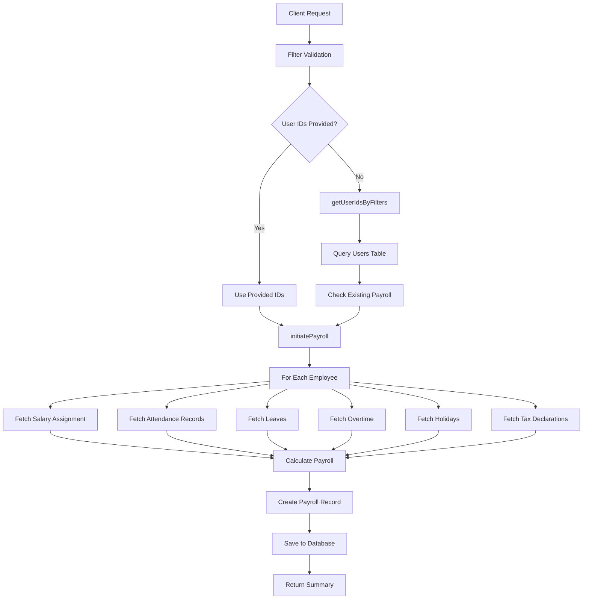
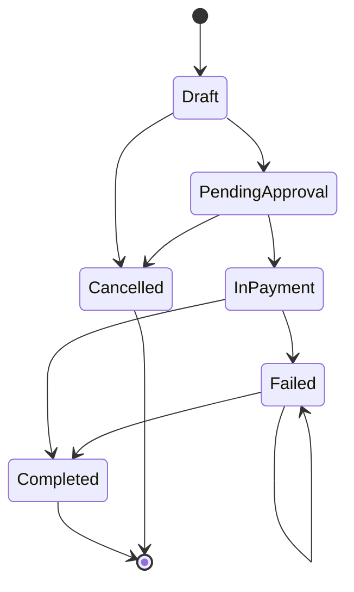
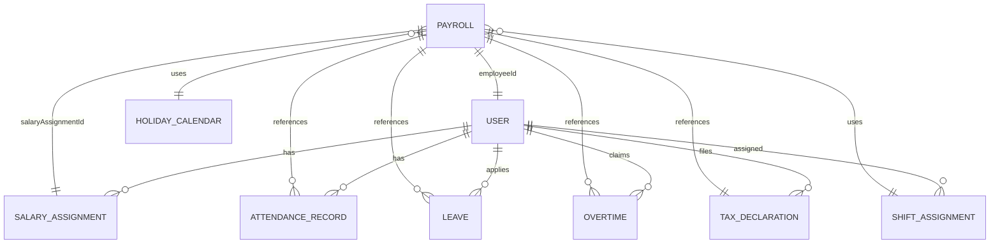

# Payroll Routes Deep Analysis

## Overview

This document provides a comprehensive analysis of the payroll routes implementation in the Zuno HR India API. It details all routes, their dependencies, related objects, referenced models, and impacted database tables.

---

## Route Summary

The payroll system consists of **7 active routes** defined in [src/routes/payroll.routes.ts](file:///Users/sureshkumar/Documents/GitHub/Zuno-hr-India-Api/src/routes/payroll.routes.ts):

| Route | Method | Authentication | Purpose |
|-------|--------|----------------|---------|
| `/generate` | POST | Required | Generate payroll for employees |
| `/summary` | GET | Required | Get payroll summary for month/year |
| `/by-users` | POST | Required | Get payroll records for specific users |
| `/status-update` | POST | Required | Update payroll status (single/batch) |
| `/import-payments` | POST | Required | Import payment status from Excel |
| `/status-update-excel` | POST | Required | Batch update status from JSON |
| `/deduction-summary` | GET | None | Get deduction summary with exports |
| `/delete` | DELETE | Required | Delete payroll records |

---

## 1. POST `/generate` - Generate Payroll

### Purpose
Initiates payroll processing for all employees or a filtered subset based on department, role, status, or specific employee IDs.

### Request Body
```typescript
{
  monthYear: string;        // YYYY-MM format
  userIds?: string[];       // Optional: specific employee IDs
  filters?: {
    departmentId?: string;
    role?: string;
    status?: string[];      // ['Active', 'On Hold', 'Resigned']
    search?: string;
    country?: string;       // 'AE' | 'IN'
  }
}
```

### Service Methods Called
- `payrollService.getUserIdsByFilters()` - Filters employees based on criteria
- `payrollService.initiatePayroll()` - Main payroll generation logic

### Database Tables Impacted

#### Primary Write Operations
- **payrolls** - Creates new payroll records (one per employee)

#### Read Operations
- **users** - Query employees by filters (department, role, status, country, search)
- **salaryassignments** - Fetch active salary structure for each employee
- **attendancerecords** - Retrieve attendance data for the month
- **leaves** - Fetch approved leaves to calculate payable days
- **overtime** - Get approved overtime hours and pay
- **holidaycalendars** - Determine holidays for the month
- **shiftassignments** - Get shift assignments for weekend calculations
- **taxdeclarations** - Fetch tax deduction details
- **payroll_deductions** - Additional manual deductions

### Data Flow



### Impacted Table Details

| Table | Operation | Fields Accessed | Purpose |
|-------|-----------|----------------|---------|
| **users** | READ | `_id`, `name`, `departmentId`, `role`, `active`, `country`, `joiningDate`, `resignations`, `bankDetails` | Employee filtering and bank information |
| **payrolls** | WRITE/READ | All fields | Check existing records, create new payroll entries |
| **salaryassignments** | READ | `userId`, `basic`, `hra`, `da`, `allowances`, `deductions`, `effectiveFrom`, `effectiveTo`, `country` | Salary structure for calculations |
| **attendancerecords** | READ | `userId`, `date`, `status`, `month`, `year`, `totalDays`, `presentDays`, `absentDays` | Attendance data for LOP calculation |
| **leaves** | READ | `userId`, `startDate`, `endDate`, `status`, `leaveType`, `isApproved` | Approved leaves for payable days |
| **overtimes** | READ | `userId`, `date`, `hours`, `status`, `overtimePay` | Overtime hours and pay |
| **holidaycalendars** | READ | `year`, `country`, `holidays[]` | Holiday calculation |
| **shiftassignments** | READ | `userId`, `shiftId`, `effectiveFrom`, `effectiveTo` | Shift-based weekend calculation |
| **taxdeclarations** | READ | `employeeId`, `financialYear`, `monthlyDeductions` | Income tax deductions |

---

## 2. GET `/summary` - Get Payroll Summary

### Purpose
Retrieve aggregated payroll summary for a specific month and year with optional status and country filters.

### Query Parameters
```typescript
{
  month: number;           // 1-12
  year: number;            // 2024-2100
  status?: PayrollStatus[]; // Filter by status
  country?: string;        // 'AE' | 'IN'
}
```

### Service Methods Called
- `payrollService.getPayrollSummary()`

### Database Tables Impacted

#### Read Operations
- **payrolls** - Aggregate payroll data for summary
- **users** - Fetch employee names and bank details for export

### Response Data
- Total employees, gross salary, deductions, net salary
- Present days, LOP days, payable days totals
- Status breakdown (Draft, PendingApproval, InPayment, Completed, Failed, etc.)
- Failed records with failure reasons
- Exportable details for payment processing

### Aggregation Pipeline
```javascript
[
  { $match: { month, year, status, country } },
  { $group: {
      totalEmployees: { $sum: 1 },
      totalGrossSalary: { $sum: "$monthlyGross" },
      totalDeductions: { $sum: "$totalDeductions" },
      totalNetSalary: { $sum: "$netSalary" },
      statusBreakdown: { ... }
  }}
]
```

---

## 3. POST `/by-users` - Get Payroll Records for Specific Users

### Purpose
Fetch payroll records for specific employee IDs for a given month and year.

### Request Body
```typescript
{
  userIds: string[];       // Array of employee IDs
  month: number;           // 1-12
  year: number;            // 2000-2100
}
```

### Service Methods Called
- `payrollService.getPayrollRecordsForUsers()`

### Database Tables Impacted

#### Read Operations
- **payrolls** - Query by employeeId, month, year
  - Fields: `employeeId`, `status`, `paymentConfirmedAt`

---

## 4. POST `/status-update` - Update Payroll Status

### Purpose
Update the status of one or multiple payroll records with status transition validation.

### Request Body
```typescript
{
  id?: string;             // Single record ID
  recordIds?: string[];    // Multiple record IDs
  status: PayrollStatus;   // New status
  failureReason?: string;  // Required for Failed status
  utrNumber?: string;      // Required for Completed status
}
```

### Status Workflow


### Service Methods Called
- `payrollService.updatePayrollStatus()`
- `payrollService.canTransition()` - Validates status transitions

### Database Tables Impacted

#### Write Operations
- **payrolls** - Update status, statusHistory, failureReason, utrNumber, paymentConfirmedAt, approvalDate, approvedBy

### Status Transition Rules

| Current Status | Allowed Next States |
|----------------|---------------------|
| Draft | PendingApproval, Cancelled |
| PendingApproval | InPayment, Cancelled |
| InPayment | Completed, Failed |
| Completed | (Terminal state) |
| Failed | Completed, Failed |
| RetryPending | InPayment, Cancelled |
| Cancelled | (Terminal state) |

---

## 5. POST `/import-payments` - Import Payment Status from Excel

### Purpose
Bulk import payment status updates from an Excel file uploaded by finance team after external payment processing.

### Request
- File upload (multipart/form-data)
- Accepts `.xlsx` files only

### Expected Excel Columns
```typescript
{
  payrollId: string;       // Payroll record ID
  employeeName?: string;   // Employee name
  status: 'Completed' | 'Failed';
  utrNumber?: string;      // UTR for successful payments
  failureReason?: string;  // Reason for failed payments
}
```

### Service Methods Called
- `payrollService.importPayrollPayments()`

### Database Tables Impacted

#### Write Operations
- **payrolls** - Batch update status, utrNumber, failureReason, statusHistory, paymentConfirmedAt

#### Process Flow
1. Read and validate Excel file
2. Normalize column names (case-insensitive)
3. Validate each row (payrollId exists, valid status)
4. Update payroll records in database
5. Return processing results with errors

---

## 6. POST `/status-update-excel` - Batch Status Update from JSON

### Purpose
Batch update multiple payroll record statuses from a JSON payload (typically after Excel import preview).

### Request Body
```typescript
{
  records: Array<{
    id: string;
    status: PayrollStatus;
    utrNumber?: string;
    failureReason?: string;
  }>
}
```

### Service Methods Called
- `payrollService.batchUpdatePayrollStatus()`

### Database Tables Impacted

#### Write Operations
- **payrolls** - Batch update status, statusHistory, utrNumber, failureReason

---

## 7. GET `/deduction-summary` - Get Deduction Summary

### Purpose
Generate tax deduction summary report for a specific month with export options (JSON, CSV, Excel).

### Query Parameters
```typescript
{
  month: string;           // 'Jan', 'Feb', ..., 'Dec'
  financialYear?: string;  // 'YYYY-YYYY'
  department?: string;
  location?: string;
  employeeId?: string;
  exportFormat?: 'csv' | 'excel' | 'json';
}
```

### Service Methods Called
- `payrollService.getDeductions()`

### Database Tables Impacted

#### Read Operations
- **users** - Filter by department, location, employeeId
  - Fields: `_id`, `name`, `departmentId`, `location`, `active`
- **payrolls** - Get professionalTax and incomeTax
  - Fields: `employeeId`, `professionalTax`, `incomeTax`, `salaryAssignmentId`, `month`, `year`
- **taxdeclarations** - Fetch monthly deductions
  - Fields: `employeeId`, `financialYear`, `monthlyDeductions[]`

### Response Fields
- Employee ID, Name, PAN
- Department, Location
- Tax to be paid (from TDS)
- Professional Tax
- Salary Assignment ID
- Month, Financial Year

---

## 8. DELETE `/delete` - Delete Payroll Records

### Purpose
Delete all payroll records for a specific month and year, optionally filtered by country.

### Query Parameters
```typescript
{
  month: number;      // 1-12
  year: number;       // 2000-2100
  country?: string;   // 'AE' | 'IN'
}
```

### Service Methods Called
- `payrollService.deletePayroll()`

### Database Tables Impacted

#### Delete Operations
- **payrolls** - Delete all matching records

> **⚠️ WARNING**: This is a destructive operation with no recovery mechanism.

---

## Core Database Models

### 1. Payroll Model (`payrolls` collection)

**Schema**: [models/payrolls.model.ts](file:///Users/sureshkumar/Documents/GitHub/Zuno-hr-India-Api/src/models/payrolls.model.ts)

#### Key Fields

| Field | Type | Required | Description |
|-------|------|----------|-------------|
| `employeeId` | ObjectId | Yes | Reference to User |
| `salaryAssignmentId` | ObjectId | Yes | Reference to SalaryAssignment |
| `assigned` | Object | Yes | Original assigned salary components |
| `monthlyGross` | Number | Yes | Total gross salary |
| `basic`, `hra`, `da` | Number | Yes | Salary components |
| `airTicketAllowance` | Number | Yes | Air ticket allowance (UAE) |
| `medicalAllowance` | Number | Yes | Medical allowance |
| `epfEmployee`, `epfEmployer` | Number | Yes | EPF contributions (India) |
| `esiEmployee`, `esiEmployer` | Number | Yes | ESI contributions (India) |
| `professionalTax` | Number | Yes | Professional tax (India) |
| `incomeTax` | Number | Yes | TDS deduction |
| `totalDeductions` | Number | Yes | Sum of all deductions |
| `overtimeHours`, `overtimePay` | Number | No | Overtime calculations |
| `netSalary` | Number | Yes | Final net salary |
| `month`, `year` | Number | Yes | Payroll period |
| `totalDaysInMonth` | Number | Yes | Calendar days |
| `presentDays` | Number | Yes | Working days present |
| `LOPDays` | Number | Yes | Loss of pay days |
| `payableDays` | Number | Yes | Total payable days |
| `status` | Enum | Yes | Draft, PendingApproval, InPayment, Completed, Failed, RetryPending, Cancelled |
| `statusHistory` | Array | No | Status change audit trail |
| `utrNumber` | String | No | Payment UTR reference |
| `country` | Enum | Yes | 'AE' or 'IN' |

#### Indexes
- Unique: `{ employeeId, monthYear, month, year }`

---

### 2. User Model (`users` collection)

**Referenced Fields**:
- `_id`, `name`, `email`, `departmentId`, `role`, `location`
- `country`, `joiningDate`, `active`
- `bankDetails[]` - Bank account information
- `resignations[]` - Resignation status

---

### 3. SalaryAssignment Model (`salaryassignments` collection)

**Purpose**: Stores active salary structure for each employee

**Key Fields**:
- `userId` - Employee reference
- `basic`, `hra`, `da`, `otherAllowance`
- `travelAllowance`, `airTicketAllowance`, `medicalAllowance`
- `monthlyGross`, `annualCTC`
- `effectiveFrom`, `effectiveTo`
- `country` - Country-specific salary rules
- `statutoryDeductions` - EPF, ESI, Professional Tax config

---

### 4. AttendanceRecord Model (`attendancerecords` collection)

**Purpose**: Daily attendance tracking

**Key Fields**:
- `userId`, `date`, `status`
- `month`, `year`
- `presentDays`, `absentDays`, `totalDays`

---

### 5. Leave Model (`leaves` collection)

**Purpose**: Leave requests and approvals

**Key Fields**:
- `userId`, `startDate`, `endDate`
- `leaveType`, `status`, `isApproved`
- `totalDays`

**Used For**: Calculating payable days in payroll

---

### 6. Overtime Model (`overtimes` collection)

**Purpose**: Overtime hours tracking

**Key Fields**:
- `userId`, `date`, `hours`
- `status`, `overtimePay`

**Used For**: Adding overtime pay to payroll

---

### 7. HolidayCalendar Model (`holidaycalendars` collection)

**Purpose**: Country-specific holiday calendar

**Key Fields**:
- `year`, `country`
- `holidays[]` - List of holidays with dates and types

**Used For**: Holiday-based attendance calculations

---

### 8. ShiftAssignment Model (`shiftassignments` collection)

**Purpose**: Employee shift schedules

**Key Fields**:
- `userId`, `shiftId`
- `effectiveFrom`, `effectiveTo`
- `weekendDays[]`

**Used For**: Weekend calculations in payroll

---

### 9. TaxDeclaration Model (`taxdeclarations` collection)

**Purpose**: Employee tax declarations and monthly TDS calculations

**Key Fields**:
- `employeeId`, `financialYear`
- `monthlyDeductions[]` - Per month TDS breakdown
- `totalTaxLiability`

**Used For**: Calculating monthly income tax deductions

---

### 10. PayrollDeduction Model (`payroll_deductions` collection)

**Schema**: [models/payroll-deduction.model.ts](file:///Users/sureshkumar/Documents/GitHub/Zuno-hr-India-Api/src/models/payroll-deduction.model.ts)

**Purpose**: Manual deductions (if any)

**Key Fields**:
- `userId`, `month`
- `pf`, `esi`, `tds`, `professionalTax`
- `otherDeductions`, `remarks`

---

## Country-Specific Processing

### India (IN)
- **EPF**: Employee + Employer contributions
- **ESI**: Employee + Employer contributions
- **Professional Tax**: State-based slabs
- **Income Tax (TDS)**: Monthly deductions

### UAE (AE)
- **No Statutory Deductions**
- **Additional Allowances**: Air ticket, Medical
- **Gross = Net** (minus any manual deductions)

---

## Service Layer Architecture

### PayrollService Methods

#### 1. `initiatePayroll(month, year, userIds)`
- Main payroll generation orchestrator
- Fetches all related data for each employee
- Calculates salary components, deductions, net salary
- Creates payroll records in database

#### 2. `getPayrollSummary(month, year, status?, country?)`
- Aggregates payroll data
- Returns totals and exportable details

#### 3. `getUserIdsByFilters(filters, monthYear)`
- Filters employees by department, role, status, country
- Excludes employees with existing payroll for the period

#### 4. `updatePayrollStatus(params)`
- Updates single or multiple payroll statuses
- Validates state transitions
- Records status history

#### 5. `batchUpdatePayrollStatus(records, userId)`
- Bulk status updates
- Returns success/failure counts

#### 6. `importPayrollPayments(file, userId)`
- Parses Excel file
- Validates and updates payment statuses

#### 7. `getPayrollRecordsForUsers(userIds, month, year)`
- Fetches payroll records for specific users

#### 8. `deletePayroll(month, year, country?)`
- Deletes all payroll records for a period

#### 9. `getDeductions(query)`
- Generates tax deduction reports
- Exports to CSV/Excel/JSON

#### 10. `getCountryDeductionRules(country)`
- Returns country-specific deduction rules

#### 11. `validateSalaryStructureForCountry()`
- Validates salary components per country

---

## Data Relationships



---

## Impact Summary by Route

### Route 1: POST `/generate`
**Tables Impacted**: 10 (1 write, 9 read)
- ✍️ WRITE: `payrolls`
- 👁️ READ: `users`, `salaryassignments`, `attendancerecords`, `leaves`, `overtimes`, `holidaycalendars`, `shiftassignments`, `taxdeclarations`, `payroll_deductions`

### Route 2: GET `/summary`
**Tables Impacted**: 2 (read only)
- 👁️ READ: `payrolls`, `users`

### Route 3: POST `/by-users`
**Tables Impacted**: 1 (read only)
- 👁️ READ: `payrolls`

### Route 4: POST `/status-update`
**Tables Impacted**: 1 (write)
- ✍️ WRITE: `payrolls`

### Route 5: POST `/import-payments`
**Tables Impacted**: 1 (write)
- ✍️ WRITE: `payrolls`

### Route 6: POST `/status-update-excel`
**Tables Impacted**: 1 (write)
- ✍️ WRITE: `payrolls`

### Route 7: GET `/deduction-summary`
**Tables Impacted**: 3 (read only)
- 👁️ READ: `users`, `payrolls`, `taxdeclarations`

### Route 8: DELETE `/delete`
**Tables Impacted**: 1 (delete)
- 🗑️ DELETE: `payrolls`

---

## Security & Authentication

All routes except `/deduction-summary` require authentication via the `authenticate` middleware.

**Authentication Check**:
- Validates JWT token
- Attaches `request.user` with authenticated user details

---

## Error Handling

### Common Error Scenarios

1. **Invalid Month/Year Format**
   - Response: `400 Bad Request`
   - Message: "Invalid monthYear format. Use YYYY-MM."

2. **No Employees Found**
   - Response: `404 Not Found`
   - Message: "No employees found for processing payroll."

3. **Duplicate Payroll**
   - Response: `400 Bad Request`
   - Prevented by unique index on `{ employeeId, month, year }`

4. **Invalid Status Transition**
   - Response: `400 Bad Request`
   - Message: "Invalid status transition from X to Y"

5. **File Upload Errors**
   - Invalid file format
   - Missing required columns
   - Invalid data in Excel rows

---

## Performance Considerations

### Indexes
- **Payrolls**: `{ employeeId: 1, monthYear: 1, month: 1, year: 1 }` (unique)
- **Users**: Department, role, country filters
- **SalaryAssignments**: `{ userId: 1, effectiveFrom: 1 }`
- **AttendanceRecords**: `{ userId: 1, month: 1, year: 1 }`

### Optimization Opportunities
1. Batch processing for large employee counts
2. Caching of holiday calendars
3. Aggregation pipelines for summary queries
4. Async processing for Excel imports

---

## Conclusion

The payroll system is a comprehensive module that orchestrates data from **10+ database models** to generate accurate payroll calculations. It supports:

- ✅ Multi-country payroll (India & UAE)
- ✅ Status-based workflow management
- ✅ Bulk operations and Excel imports
- ✅ Comprehensive audit trails
- ✅ Tax deduction management
- ✅ Payment tracking with UTR

All routes are tightly integrated with the `PayrollService`, which serves as the central business logic layer for payroll operations.
