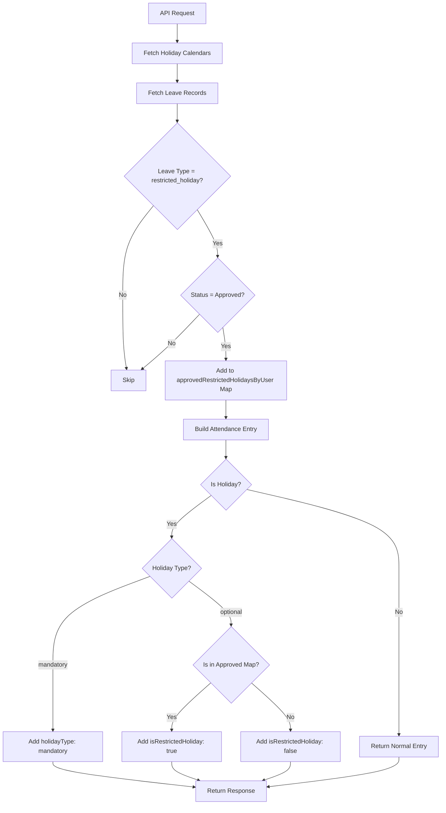

# Restricted Holiday Display Feature - Admin Attendance View

**Feature:** Display restricted holiday (RH) status in all attendance views  
**Date Implemented:** January 7, 2026  
**Modified File:** `src/services/biometric-attendance.service.ts`  
**API Endpoint:** `GET /api/biometric-attendance/admin/view`

---

## Overview

This feature adds restricted holiday (RH) display capability to the admin attendance view API. When a user has an approved restricted holiday (optional holiday), the API response will indicate this with `isRestrictedHoliday: true`, allowing the frontend to display "RH" instead of normal attendance status.

---

## Implementation Details

### Changes Made

#### 1. Fetch Approved Restricted Holidays (Lines 2215-2233)

Added a new database query to fetch approved restricted holidays from the Leave model:

```typescript
// Step 6.6: Fetch approved restricted holidays (Leave model)
const restrictedHolidayLeaves = await Leave.find({
  userId: { $in: allUserIdsArray },
  leaveType: 'restricted_holiday',
  status: 'Approved',
  startDate: { $lte: end },
  endDate: { $gte: start }
}).lean();

// Create map: userId -> Set of approved restricted holiday dates
const approvedRestrictedHolidaysByUser = new Map<string, Set<string>>();
restrictedHolidayLeaves.forEach(leave => {
  const userId = leave.userId.toString();
  if (!approvedRestrictedHolidaysByUser.has(userId)) {
    approvedRestrictedHolidaysByUser.set(userId, new Set());
  }
  const dateStr = new Date(leave.startDate).toISOString().split('T')[0];
  approvedRestrictedHolidaysByUser.get(userId)!.add(dateStr);
});
```

#### 2. Add Holiday Type and Approval Status to Response (Lines 2309-2320)

Enhanced the attendance entry object to include holiday type and restricted holiday approval status:

```typescript
// Add holiday information if applicable
if (holiday) {
  attendanceEntry.isHoliday = true;
  attendanceEntry.holidayType = holiday.type; // 'mandatory' or 'optional'
  
  // Check if this is an approved restricted holiday (optional holiday that was approved)
  if (holiday.type === 'optional') {
    const userApprovedDates = approvedRestrictedHolidaysByUser.get(userId);
    const isApproved = userApprovedDates && userApprovedDates.has(dateStr);
    attendanceEntry.isRestrictedHoliday = isApproved || false;
  }
}
```

---

## API Response Changes

### New Fields Added

| Field | Type | Description | When Present |
|-------|------|-------------|--------------|
| `holidayType` | `'mandatory' \| 'optional'` | Type of holiday | When `isHoliday: true` |
| `isRestrictedHoliday` | `boolean` | Whether the optional holiday is approved | When `holidayType: 'optional'` |

### Response Examples

#### Mandatory Holiday
```json
{
  "attendanceId": null,
  "shiftDay": "2026-01-26",
  "status": "unknown",
  "attendanceStatus": [],
  "isHoliday": true,
  "holidayType": "mandatory"
}
```

#### Approved Restricted Holiday
```json
{
  "attendanceId": null,
  "shiftDay": "2026-01-15",
  "status": "unknown",
  "attendanceStatus": [],
  "isHoliday": true,
  "holidayType": "optional",
  "isRestrictedHoliday": true
}
```
**Frontend Display:** Show **"RH"**

#### Unapproved Restricted Holiday
```json
{
  "attendanceId": null,
  "shiftDay": "2026-01-20",
  "status": "unknown",
  "attendanceStatus": [],
  "isHoliday": true,
  "holidayType": "optional",
  "isRestrictedHoliday": false
}
```
**Frontend Display:** Show normal status (Present/Absent/etc.)

#### Normal Working Day
```json
{
  "attendanceId": "507f1f77bcf86cd799439011",
  "shiftDay": "2026-01-08",
  "status": "complete",
  "attendanceStatus": ["On-Time"]
}
```
**No holiday fields present**

---

## Frontend Integration

### Display Logic

```javascript
function getAttendanceDisplayText(entry) {
  // Priority 1: Check for approved restricted holiday
  if (entry.isHoliday && entry.holidayType === 'optional' && entry.isRestrictedHoliday) {
    return 'RH'; // Approved restricted holiday
  }
  
  // Priority 2: Check for mandatory holiday
  if (entry.isHoliday && entry.holidayType === 'mandatory') {
    return 'H'; // Mandatory holiday
  }
  
  // Priority 3: Unapproved optional holiday - show normal status
  if (entry.isHoliday && entry.holidayType === 'optional' && !entry.isRestrictedHoliday) {
    return getStatusText(entry.status); // Present, Absent, etc.
  }
  
  // Priority 4: Normal day
  return getStatusText(entry.status);
}
```

### Color Coding (Optional)

```javascript
function getAttendanceColor(entry) {
  if (entry.isHoliday && entry.holidayType === 'mandatory') {
    return '#800080'; // Purple for mandatory holiday
  }
  
  if (entry.isHoliday && entry.holidayType === 'optional' && entry.isRestrictedHoliday) {
    return '#800080'; // Purple for approved restricted holiday
  }
  
  // Other status colors...
}
```

---

## Data Flow



---

## Scenarios Covered

### Scenario 1: Mandatory Holiday
- **Input:** User has mandatory holiday in calendar
- **Output:** `holidayType: 'mandatory'`
- **Display:** "H"

### Scenario 2: Approved Restricted Holiday
- **Input:** User has optional holiday + approved Leave record
- **Output:** `holidayType: 'optional'`, `isRestrictedHoliday: true`
- **Display:** "RH"

### Scenario 3: Unapproved Restricted Holiday
- **Input:** User has optional holiday, no approved Leave
- **Output:** `holidayType: 'optional'`, `isRestrictedHoliday: false`
- **Display:** Normal status (Present/Absent)

### Scenario 4: Worked on Restricted Holiday
- **Input:** Approved restricted holiday + attendance record
- **Output:** Both attendance data AND `isRestrictedHoliday: true`
- **Display:** "RH (Worked)" or show both indicators

### Scenario 5: Normal Working Day
- **Input:** Regular working day
- **Output:** No holiday fields
- **Display:** Normal status

### Scenario 6: Weekend
- **Input:** Weekend day
- **Output:** `isWeekend: true`, no holiday fields
- **Display:** "Off" or weekend indicator

### Scenario 7: WFH Day
- **Input:** Approved WFH
- **Output:** `isWFH: true`, no holiday fields
- **Display:** "WFH" or work-from-home indicator

---

## Consistency with Excel Export

This implementation maintains consistency with the existing Excel export feature (`generateAdminAttendanceExcel`):

| Feature | Excel Export | JSON API | Status |
|---------|-------------|----------|--------|
| Data Source | Leave model (`leaveType: 'restricted_holiday'`) | Leave model (`leaveType: 'restricted_holiday'`) | ✅ Same |
| Mandatory Holiday | Shows "H" | `holidayType: 'mandatory'` | ✅ Equivalent |
| Approved RH | Shows "RH" | `isRestrictedHoliday: true` | ✅ Equivalent |
| Unapproved RH | Shows normal status | `isRestrictedHoliday: false` | ✅ Equivalent |

---

## Backward Compatibility

✅ **Non-Breaking Change**

- All existing fields remain unchanged
- New fields are only added when applicable
- Old clients will ignore new fields
- New clients can progressively enhance UI

---

## Performance Impact

- **Added:** 1 additional database query (batch query for all users)
- **Query Type:** Indexed query on `userId`, `leaveType`, `status`, `startDate`, `endDate`
- **Impact:** Minimal - follows same pattern as existing WFH query
- **Optimization:** Uses Map/Set for O(1) lookup performance

---

## Testing

### Manual Testing Steps

1. **Test Approved Restricted Holiday:**
   ```bash
   # Create Leave record
   {
     userId: "...",
     leaveType: "restricted_holiday",
     status: "Approved",
     startDate: "2026-01-15",
     endDate: "2026-01-15"
   }
   
   # Call API
   GET /api/biometric-attendance/admin/view?startDate=2026-01-01&endDate=2026-01-31
   
   # Verify response contains:
   {
     "isHoliday": true,
     "holidayType": "optional",
     "isRestrictedHoliday": true
   }
   ```

2. **Test Unapproved Restricted Holiday:**
   ```bash
   # Ensure NO Leave record exists for optional holiday date
   
   # Call API
   GET /api/biometric-attendance/admin/view?startDate=2026-01-01&endDate=2026-01-31
   
   # Verify response contains:
   {
     "isHoliday": true,
     "holidayType": "optional",
     "isRestrictedHoliday": false
   }
   ```

3. **Test Excel Export:**
   ```bash
   GET /api/biometric-attendance/admin/view/excel?startDate=2026-01-01&endDate=2026-01-31
   
   # Verify Excel shows:
   # - "H" for mandatory holidays
   # - "RH" for approved restricted holidays
   # - Normal status for unapproved restricted holidays
   ```

---

## Related Files

- **Service:** `src/services/biometric-attendance.service.ts`
- **Routes:** `src/routes/biometric-attendance.routes.ts`
- **Models:** 
  - `src/models/leave.model.ts` (Leave with `leaveType: 'restricted_holiday'`)
  - `src/models/holiday-calendar.model.ts` (Holiday with `type: 'optional'`)
- **Related Features:**
  - Excel export: `generateAdminAttendanceExcel` method
  - Leave management: `src/services/leave.service.ts`
  - Optional holiday requests: `src/services/optional-holiday.service.ts`

---

## Notes

1. **Restricted holidays are stored as Leave records** with `leaveType: 'restricted_holiday'`
2. **Only approved restricted holidays** (status: 'Approved') are shown as "RH"
3. **Mandatory holidays** always show as "H" regardless of approval
4. **Unapproved optional holidays** show normal attendance status
5. **Employees can work on restricted holidays** - both attendance and RH flag will be present

---

## Future Enhancements

- [ ] Add restricted holiday count to user summary
- [ ] Add filter to show only restricted holiday days
- [ ] Add bulk approval for restricted holiday requests
- [ ] Add notification when restricted holiday is approved/rejected
- [ ] Add restricted holiday balance tracking

---

**Last Updated:** January 7, 2026  
**Version:** 1.0.0
